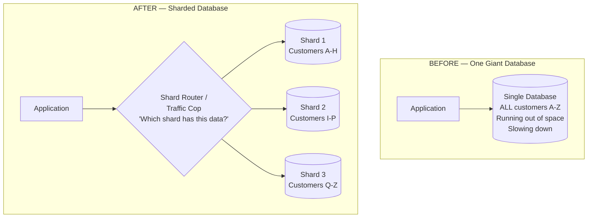
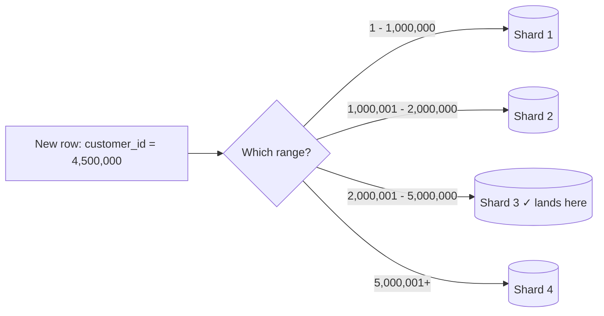
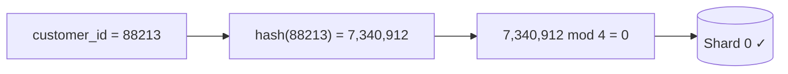
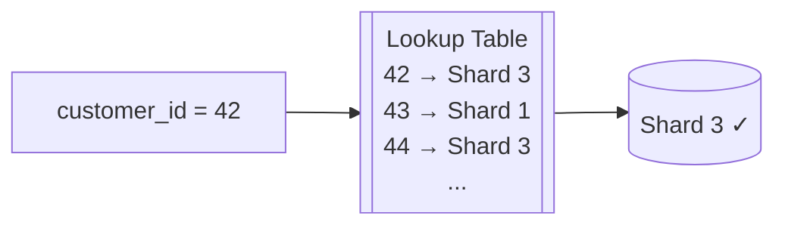
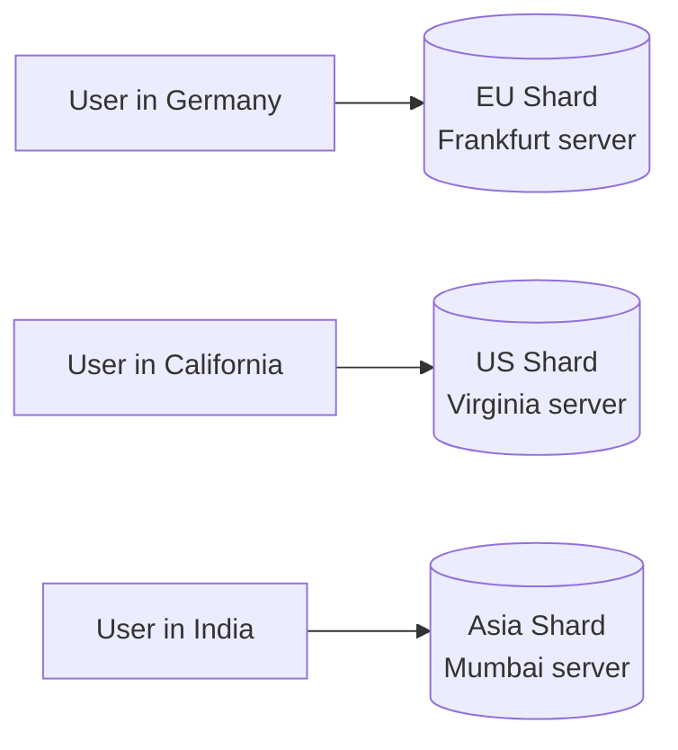
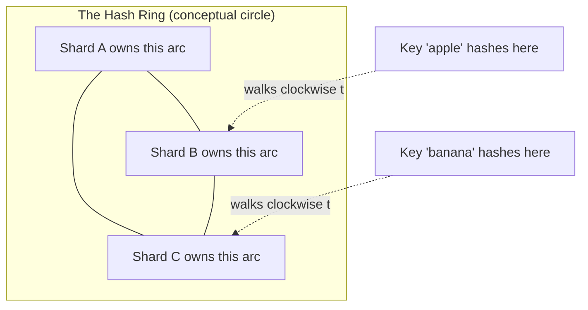

# Database Sharding — Explained Like You're Not a Programmer

> **Note on diagrams:** the diagrams below are written in **Mermaid** (renders automatically in
> GitHub, VS Code with the Mermaid preview extension, Obsidian, GitLab, Notion, etc.). Plain-text
> fallback (ASCII) is included for the most important diagram in case you're reading this in an
> editor that doesn't render Mermaid.

---

## 1. The Problem — Why Does This Even Come Up?

Imagine a library that started small — one building, one librarian, a few thousand books on a
few hundred shelves. Finding a book is fast because the librarian basically knows where
everything is, and there aren't that many people visiting at once.

Now imagine that library becomes wildly popular. Millions of books. Thousands of visitors an
hour, all asking for books, returning books, reserving books, at the same time.

At some point, **one building — no matter how big you make it — cannot handle this alone**:

- The building runs out of physical shelf space (**storage limit**).
- The single librarian's desk becomes a bottleneck — a queue forms for every request (**throughput
  limit**).
- If that one building burns down, catches fire, or the single librarian quits, **the whole
  library goes down** — nobody can find anything (**single point of failure**).

A database has the exact same problem. A "database" is just a very organized, very fast digital
filing system. As an app grows — more users, more orders, more messages, more rows of data — a
single database server eventually hits the same three walls: **runs out of disk space, runs out
of processing capacity, and becomes a single point of failure.**

**Sharding is one answer to this problem: instead of one giant library, build several
medium-sized libraries, and split the books between them by some rule**, so no single building
has to hold everything or serve everyone alone.

---

## 2. What Is Sharding? (The Simple Definition)

> **Sharding = splitting one big database into several smaller databases ("shards"), where each
> shard holds only a slice of the total data, based on some rule.**

Each shard:
- Runs on its own server (its own "building").
- Holds only *part* of the data — not a copy of everything.
- Can be queried independently, in parallel with the other shards.

This is different from just "having a backup copy" — that's called **replication**, and it's a
different concept. Let's clear that up before going further, because people mix these up a lot.

### Sharding vs. Replication vs. Partitioning — don't confuse these three

| Concept | What it means | Analogy |
|---|---|---|
| **Replication** | Full **copies** of the *same* data on multiple servers, kept in sync. Purpose: reliability + read speed. | Photocopying the entire library and putting identical copies in 3 buildings. |
| **Partitioning** | Splitting *one* table into pieces, usually still on the *same* server. Purpose: manage a huge single table more efficiently. | Splitting one overcrowded shelf into multiple shelves, still in the same building. |
| **Sharding** | Splitting the *whole database* across **multiple separate servers**, each holding a different slice of the data. Purpose: scale beyond what one server can handle. | Splitting the library into several separate buildings in different locations, each holding different books. |

Sharding is really "partitioning taken to the next level, across physical machines instead of
just across tables." That's why some databases call it **"horizontal partitioning."**

### The core diagram

**Mermaid version:**



**Plain-text fallback:**

```
BEFORE:
   [ Application ] ---> [ ONE Database holding EVERYTHING ]
                          (all customers A-Z, all orders, all history)

AFTER (sharded):
                         +------------------------------+
   [ Application ] --->  |   Shard Router / Traffic Cop  |
                         |  "which shard has this data?" |
                         +------------------------------+
                            |          |            |
                            v          v            v
                       [Shard 1]  [Shard 2]    [Shard 3]
                       (A-H)      (I-P)        (Q-Z)
```

The "Shard Router" (also called a **query router**, **proxy**, or **shard map**) is the piece of
software that looks at an incoming request and decides *which* shard actually has the answer, so
the application doesn't have to know or care.

---

## 3. The Most Important Decision: The Sharding Key

Before splitting anything, you must decide **which piece of data determines which shard a row
goes to.** This is called the **sharding key** (or partition key). Get this wrong, and every
problem in this document gets *worse*, not better.

Common sharding keys:
- `customer_id` / `user_id` — everything belonging to one customer lives together.
- `region` / `country` — data lives close to where the user physically is.
- `order_id` — orders spread out, but a customer's orders may land on different shards.
- `tenant_id` — for software used by many separate companies (each company = one "tenant").

Think of the sharding key as **the rule the librarian uses to decide which building a book goes
into.** Everything else in this document is really just "which rule should the librarian use, and
what goes wrong with each rule."

---

## 4. Sharding Strategies — The Different "Rules" You Can Use

### 4.1 Range-Based Sharding

**The rule:** split data by *ranges* of the sharding key's value.



Like a library organizing books alphabetically: A–F in building 1, G–M in building 2, and so on.

**Advantages:**
- Simple to understand and implement.
- **Range queries are fast** — "give me all orders from January to March" can often be answered
  by hitting just one or two shards, not all of them.

**Disadvantages / Challenges:**
- **Hotspots.** If your sharding key is something like "signup date" or an auto-incrementing
  order ID, *all new data* always lands on the *newest, last* shard. That one shard gets
  hammered with all the write traffic while the older shards sit idle — like every new visitor
  to the library only ever going to the newest building, ignoring the other four completely.
- Uneven data distribution over time if activity isn't spread evenly across the range (e.g.
  one country's customer ID range grows much faster than another's).

**When it's used:**
- Time-series data where you usually query by date range (metrics, logs, financial transaction
  history) and the "always writes to the newest shard" hotspot is acceptable because old shards
  become read-only and read traffic *is* spread out (e.g. analytics dashboards querying old
  months).
- Data where range scans are the dominant access pattern.

**When it's NOT used / avoided:**
- High-write systems where the sharding key increases monotonically (auto-increment IDs,
  timestamps) and writes need to be spread evenly — the hotspot problem makes this a bad fit.
  This is the single most common range-sharding mistake.
- Systems where queries are almost always "give me one specific record," not "give me a range" —
  range sharding's main advantage (fast range scans) is wasted, and you inherit its
  hotspot risk for nothing.

---

### 4.2 Hash-Based Sharding

**The rule:** run the sharding key through a hash function (a formula that turns any input into
a fixed, evenly-scattered number), then use that number to pick a shard — usually
`hash(key) % number_of_shards`.



Like assigning every visitor a random-looking locker number based on a formula applied to their
name — nobody can predict it just by looking at the name, but the same name always produces the
same locker.

**Advantages:**
- **Even distribution.** A good hash function scatters data (and therefore load) roughly equally
  across all shards — no hotspots like range sharding has.
- Simple to reason about once implemented.

**Disadvantages / Challenges:**
- **Range queries become expensive.** "Give me all orders from January" now has to ask *every
  single shard* and merge the results, because hashing destroyed any ordering — a January order
  could be hashed onto any shard.
- **Resharding is painful.** This is the big one. If you go from 4 shards to 5, the formula
  `hash(key) % 4` becomes `hash(key) % 5` — and that changes the *answer* for almost every single
  row. Nearly all your data has to be physically moved to a different shard at once. (Section 5.2
  covers the fix: **consistent hashing**.)

**When it's used:**
- High-write-throughput systems where writes must be evenly spread (chat messages, user
  activity feeds, session data) and lookups are almost always "give me one specific
  key," not a range.
- Multi-tenant SaaS platforms sharding by `tenant_id`, where tenants are numerous and roughly
  similar in size, so hashing spreads them evenly.

**When it's NOT used / avoided:**
- Systems where range queries ("all records this month," "all records between X and Y") are a
  core, frequent access pattern — you'd pay the "ask every shard" cost on nearly every query.
- Systems that expect to resize their shard count frequently, *without* using consistent hashing
  — plain modulo hashing turns every resize into a massive, risky data-migration event.

---

### 4.3 Directory-Based (Lookup Table) Sharding

**The rule:** keep a separate, small "map" (a lookup table) that explicitly records which shard
each key lives on — instead of calculating it from a range or a formula.



Like a librarian keeping a card-catalog index that says exactly which building each specific book
is in — instead of relying on alphabetical order or a formula, there's a literal lookup entry per
book.

**Advantages:**
- **Maximum flexibility.** You can move any individual piece of data to any shard at any time,
  for any reason (e.g. rebalancing load, moving a huge customer to their own dedicated shard) —
  just update one row in the lookup table.
- Solves the resharding pain of hash-based sharding — moving data is a deliberate, controlled,
  one-row-at-a-time update, not a mass recalculation.

**Disadvantages / Challenges:**
- **The lookup table itself becomes a new single point of failure and a new bottleneck.** Every
  single query now needs an extra hop: "ask the lookup table, then ask the real shard." If the
  lookup table goes down, the *entire system* goes down, because nothing can figure out where to
  look.
- Extra operational complexity: the lookup table needs its own replication/backup strategy, and
  it needs to be kept in perfect sync with reality.

**When it's used:**
- Systems where individual accounts/customers vary wildly in size (a few huge "whale" customers,
  many small ones) and you specifically need the ability to give a huge customer their own
  dedicated shard, or move them off an overloaded one, without a mass-recalculation event.
- Systems already investing in a strongly-available, well-replicated small metadata store (this
  pattern is common in large-scale systems that already run something like this for other
  purposes).

**When it's NOT used / avoided:**
- Small-to-medium teams without the operational maturity to run a *second* highly-available,
  perfectly-consistent database (the lookup table) just to run the *first* one. This trades one
  scaling problem for a reliability problem, and is usually not worth it below a certain scale.
- Latency-sensitive systems where the extra "ask the lookup table first" network hop on every
  single query is unacceptable.

---

### 4.4 Geography / Location-Based Sharding

**The rule:** split data by physical region — e.g., European customers' data stays on servers in
Europe, US customers' data stays on servers in the US.



Like a global retail chain keeping regional warehouses — the German warehouse stocks for German
stores, so a German store doesn't have to wait for a shipment from a US warehouse.

**Advantages:**
- **Lower latency** — data lives physically closer to the user asking for it.
- **Legal / compliance fit.** Some laws (e.g., data-residency rules in the EU, or industry
  regulations) *require* certain users' data to physically stay within a country or region — geo
  sharding satisfies this by design, not as an afterthought.

**Disadvantages / Challenges:**
- **Uneven load if user population isn't evenly spread** — a region with far more users
  becomes a much bigger, busier shard than a sparsely-populated region's shard, undoing the
  "spread the load evenly" benefit sharding is usually chosen for.
- A user who travels or moves countries creates an edge case: does their data move shards, stay
  where it was, or get accessed cross-region (reintroducing the latency problem you were trying
  to avoid)?

**When it's used:**
- Global consumer apps where the majority of a user's activity/queries are naturally local to
  their own region (social media feeds, ride-hailing, food delivery).
- Anything with a legal data-residency requirement — here it's not even optional, it's mandatory.

**When it's NOT used / avoided:**
- Small apps operating in a single country/region — there is no "geography" to split by, so this
  adds complexity for zero benefit.
- Apps where most traffic is inherently cross-region anyway (e.g. a global company's
  internal finance system that consolidates data from everywhere) — geo sharding would just
  reintroduce cross-shard queries constantly, canceling out the latency benefit.

---

### 4.5 Consistent Hashing (the fix for hash-sharding's resharding pain)

This deserves its own section because it directly solves hash-based sharding's biggest weakness
(Section 4.2).

**The idea:** instead of `hash(key) % number_of_shards` (where changing the shard count reshuffles
*everything*), imagine the range of all possible hash values arranged in a **circle**. Each shard
owns a segment of that circle. A key's shard is decided by "walk clockwise from the key's hash
position until you hit a shard."



**Why this fixes the resharding problem:** when you add a new Shard D to the ring, it only takes
over a small arc of the circle from its *immediate neighbor* — every other shard's data is
completely untouched. Instead of "recalculate and move almost everything" (plain hash sharding),
it's "move only the small slice that now belongs to the new shard."

**Advantages:**
- Even distribution, same as regular hashing.
- **Adding or removing a shard only moves a small fraction of the data**, not nearly all of it —
  this is the entire reason consistent hashing exists.

**Disadvantages / Challenges:**
- More complex to implement and reason about than plain modulo hashing.
- Without care, the circle can still end up lumpy (some shards' arcs bigger than others) — solved
  in practice using **"virtual nodes"** (each physical shard is given many small positions around
  the ring instead of one big one, smoothing out the distribution) — but that's an extra layer of
  complexity on top of an already non-trivial technique.

**When it's used:**
- Large-scale distributed systems that expect to grow or shrink their number of shards/nodes
  over time and cannot tolerate a "move almost all the data" event every time that happens
  (distributed caches like Memcached/Redis Cluster, distributed databases like Cassandra and
  DynamoDB use this internally).

**When it's NOT used / avoided:**
- Small systems with a fixed, rarely-changing number of shards — plain hash sharding (Section
  4.2) is simpler and the resharding problem it's solving may never actually come up.
- Teams without prior distributed-systems experience — the added conceptual complexity (rings,
  virtual nodes) is a real cost, and should be justified by an actual, expected need to
  resize the cluster, not adopted "just in case."

---

## 5. Universal Challenges — These Show Up No Matter Which Strategy You Pick

These are the problems that come *from splitting data across machines in general* — every
strategy above inherits some or all of them.

### 5.1 Challenge: Cross-Shard Joins and Queries

**The problem:** In one database, asking "show me this customer's name along with all their
orders" is one simple, fast query, because the customer table and order table live in the same
place. Once sharded, if a customer's info is on Shard 1 but their orders happen to be scattered
across Shards 2 and 3, that "simple" question now requires talking to three different databases
and stitching the answer together in your application code.

**Analogy:** you split the library into 5 buildings. Now a visitor asks "what's the full history
of everything I've ever borrowed?" — the librarian has to run to *all 5 buildings*, ask each one,
and manually combine five separate answer-slips into one, instead of just checking one card in
one building.

**How it's solved:**
- **Design the sharding key so related data lands on the same shard together** (e.g. shard by
  `customer_id`, and make sure the *orders* table is *also* sharded by that same customer's ID,
  not by `order_id`) — this is called **co-locating** related data, and it's the single best fix.
- For the cases that genuinely can't be co-located, **denormalize**: deliberately store a
  duplicate copy of the small amount of data you need (e.g. copy the customer's name directly
  onto each order row) so you don't need a cross-shard join just to display it — accepting some
  data duplication as the trade-off.
- For heavier analytical questions ("total revenue across all customers, all shards, this
  quarter"), don't run that against the live sharded database at all — pipe the data into a
  separate reporting/analytics database (a **data warehouse**) built specifically for
  cross-shard aggregation, on a schedule, instead of live-querying every shard on every
  dashboard load.

---

### 5.2 Challenge: Rebalancing When You Add or Remove Shards

**The problem:** covered in detail under hash sharding (4.2), but it applies more broadly —
whenever the *number* of shards changes, existing data may need to physically move to keep the
distribution even. This is a delicate, risky operation: it usually needs to happen without
downtime, without losing any writes that happen mid-move, and without doubling storage costs
during the transition.

**How it's solved:**
- **Consistent hashing** (Section 4.5) minimizes how much data has to move per resize event.
- **Directory-based sharding** (Section 4.3) sidesteps this almost entirely, since moving data is
  already a deliberate, one-record-at-a-time operation by design.
- **Over-provisioning shard *slots* in advance** — e.g. starting with 1,000 small logical shards
  spread across just 4 real physical servers. Growing later means moving whole logical shards
  onto new physical servers (an infrastructure change), rather than recalculating every
  individual row's placement (a data change) — a much safer, more mechanical operation.

---

### 5.3 Challenge: Hotspots (Uneven Load)

**The problem:** even with a technically "even" split of data, *load* isn't always proportional to
*data volume*. One customer might be 0.01% of your rows but generate 40% of your traffic (a
celebrity account, a huge enterprise client). Their one shard becomes overloaded while every other
shard is nearly idle.

**How it's solved:**
- Monitor per-shard load (not just per-shard row count) and react to it.
- Give unusually large/active keys **their own dedicated shard** — directory-based sharding
  (4.3) is specifically good at this because it allows moving one specific key without touching
  anything else.
- **Cache aggressively** in front of the hot shard (so repeated reads for the same hot data don't
  all hit the database) — this doesn't fix the imbalance, but it absorbs most of the pain of it.

---

### 5.4 Challenge: Generating Unique IDs Across Shards

**The problem:** a normal single database can just auto-increment an ID column (1, 2, 3, 4...)
and guarantee uniqueness for free, because there's only one place counting. With multiple
independent shards, if Shard A and Shard B *each* auto-increment starting from 1, they will both
eventually produce an order with `id = 500` — two completely different orders with the same ID.

**How it's solved:**
- **Prefix or encode the shard number into the ID itself** — e.g. Shard 3's rows always start
  their IDs at `3,000,000,000` and Shard 3 only ever increments from there; Shard 4 starts at
  `4,000,000,000`, and so on. Simple, but caps how many rows one shard can ever hold.
- **A dedicated, centralized ID-generation service** (e.g. Twitter's well-known "Snowflake"
  approach) that hands out globally-unique IDs on request, usually built from a timestamp + a
  machine identifier + a counter, so collisions are structurally impossible without needing a
  central database lock.
- **UUIDs** (long random-looking identifiers) — collisions are astronomically unlikely without
  any coordination at all, at the cost of a bigger, less human-readable ID and slightly worse
  database index performance than a small sequential integer.

---

### 5.5 Challenge: Transactions and Data Consistency Across Shards

**The problem:** in one database, "move $50 from Account A to Account B" is a **transaction** —
either both the withdrawal and the deposit happen, or neither does; the database guarantees this
automatically. If Account A and Account B live on *different* shards, that guarantee doesn't come
for free anymore — a crash between step 1 (withdraw) and step 2 (deposit) could leave the money
gone from A but never arrived at B.

**How it's solved:**
- **Avoid the problem by design** where possible — co-locate accounts that frequently transact
  with each other on the same shard (not always possible, e.g. two random users transacting with
  each other).
- **The Saga pattern** — break the operation into a sequence of local transactions, each shard
  doing its own step, with a predefined "undo" (compensating action) for every step, so if step 2
  fails, step 1 is deliberately reversed rather than left in a broken half-done state.
- **Two-Phase Commit (2PC)** — a coordinator asks every involved shard to "prepare" the change and
  confirm they *can* commit, and only tells all of them to actually commit once every shard has
  said yes. Guarantees consistency, but is slow and the coordinator itself becomes a new single
  point of failure if it crashes mid-process — used less often in practice for this reason.

---

### 5.6 Challenge: Schema Changes Across Every Shard

**The problem:** adding one new column, or changing one data type, is a single command on a
single database. On a sharded system with 50 shards, that's the same command run 50 separate
times, on 50 separate servers — and if it succeeds on 48 of them and fails on 2 (network blip,
one server briefly overloaded), your shards now have *different, inconsistent schemas*, which can
silently break the application in confusing, hard-to-reproduce ways.

**How it's solved:**
- **Automated, scripted schema-migration tooling** that applies the change to every shard, tracks
  exactly which shards succeeded/failed, and can safely retry or roll back the failures — never
  done by hand, one shard at a time.
- **Backward-compatible, staged rollouts**: deploy a schema change that both old and new
  application code can work with, roll it out to all shards, confirm success everywhere, *then*
  deploy the application code that actually uses the new column — so a shard that's momentarily
  behind doesn't crash the app.

---

### 5.7 Challenge: Operational Complexity (Backups, Monitoring, Deployment)

**The problem:** one database means one thing to back up, one thing to monitor, one thing to
apply security patches to. Fifty shards mean fifty of everything — fifty backup jobs that all
need to succeed, fifty sets of metrics to watch, fifty servers that all need patching in a
coordinated way without taking the whole system down.

**How it's solved:**
- Treat this as an infrastructure-automation problem from day one, not an afterthought:
  infrastructure-as-code, automated backup verification (not just "the backup job ran," but "the
  backup is provably restorable"), and centralized dashboards that show *all* shards' health on
  one screen rather than fifty separate ones.
- This is precisely why sharding is a decision with real ongoing cost — see Section 6.

---

### 5.8 Challenge: Cross-Shard Reporting and Analytics

**The problem:** business questions like "total revenue this month across every customer" or
"which product sold the most units globally" need to look at *all* the data, cutting directly
across whatever rule you used to shard it.

**How it's solved:**
- **Never run heavy analytical queries against the live, sharded, transactional database** — this
  both slows down real customer traffic and requires querying every shard synchronously.
- Instead, use a background pipeline (**ETL** — Extract, Transform, Load) that regularly copies
  data out of every shard into a separate **data warehouse** built for exactly this kind of
  whole-dataset question, on its own schedule, isolated from live traffic.

---

## 6. When You Should NOT Shard At All

Sharding is a powerful tool, but it is also **one of the most expensive, hardest-to-reverse
architectural decisions** a system can make — every challenge in Section 5 is a permanent, ongoing
operational cost from the day you shard onward, not a one-time setup fee. Don't reach for it by
default. Avoid sharding when:

- **A single, more powerful server would solve the problem.** Modern hardware is enormous —
  "vertical scaling" (a bigger server: more CPU, more RAM, faster disks) solves a huge number of
  scaling problems far more cheaply and simply than sharding does. Always ask "can we just make
  the one database bigger?" before asking "how do we split it?"
- **Read load — not write load or storage — is the actual bottleneck.** If the real problem is
  "too many people reading the same data," **read replicas** (Section 2's "replication") solve it
  far more simply: keep one primary database for writes, and several read-only copies to spread
  out read traffic. This avoids every single challenge in Section 5, because the data is never
  actually split.
- **Your data volume genuinely fits comfortably on one well-specified server**, even accounting
  for a few years of realistic growth. Sharding "just in case" for data that will never actually
  outgrow one machine is pure added complexity with no corresponding benefit — a classic case of
  premature optimization.
- **Your application relies heavily on complex joins and strong transactional consistency across
  data that can't be cleanly co-located on one shard.** If the business logic fundamentally needs
  to atomically touch many different, unrelated entities together, and there's no clean sharding
  key that keeps them together, sharding will fight your data model at every turn (Section 5.1
  and 5.5) rather than help you.
- **Your team/organization doesn't yet have the operational maturity for the ongoing cost**
  described in Section 5.7. A small team maintaining a sharded system with limited
  automation tooling can easily spend more engineering time firefighting shard-related
  incidents than the sharding ever saved them in server costs.
- **A "distributed SQL" database is a better fit.** Newer database systems (e.g. Google Spanner,
  CockroachDB, YugabyteDB) implement sharding *internally*, automatically, behind a normal-looking
  single-database interface — giving many of sharding's scaling benefits without your application
  or team having to manually design, implement, and operate the sharding logic yourselves. If
  available and within budget, this is often a better trade-off than hand-rolled sharding.

**Rule of thumb:** sharding is usually the *last* resort after vertical scaling, caching, read
replicas, and query optimization have all been tried and are no longer enough — not the *first*
tool reached for when a database "feels slow."

---

## 7. Quick Decision Cheat-Sheet

| Strategy | Best for | Avoid when |
|---|---|---|
| **Range-based** | Time-series data, frequent range queries (date ranges, ID ranges) | Sharding key increases monotonically + high write volume (hotspot risk) |
| **Hash-based** | Even write distribution, point lookups by exact key | Range queries are common; shard count changes often (without consistent hashing) |
| **Directory-based (lookup table)** | Wildly uneven data sizes per key; need to move individual keys freely | Small teams; can't operate a second highly-available metadata store |
| **Geo-based** | Global apps with regional traffic; legal data-residency requirements | Single-region apps; traffic is inherently cross-region anyway |
| **Consistent hashing** | Large systems expecting frequent resizing (add/remove shards) | Small, fixed-size clusters — plain hashing is simpler and sufficient |
| **No sharding — vertical scaling / replicas instead** | Most systems, most of the time | N/A — this is the default; only leave it when you've hit real, measured limits |

---

## 8. Real-World Examples (for grounding)

- **Instagram** (early scaling era) sharded its Postgres database by user ID using a custom
  hashing/co-location scheme, specifically designed so that a user's own posts always lived on
  the same shard as their profile — avoiding the cross-shard-join problem (5.1) for the most
  common query pattern (viewing your own profile and posts).
- **Twitter's "Snowflake"** ID generator was built specifically to solve the unique-ID problem
  (5.4) at massive scale, without needing a single centralized counter.
- **Discord** shards messages by `channel_id`, since almost every real query ("show me this
  channel's message history") only ever needs one channel's data — a deliberate co-location
  choice to avoid cross-shard queries.
- **MongoDB / Cassandra / DynamoDB** all offer hash-based sharding (often with consistent
  hashing under the hood) as a built-in, managed feature, rather than something an application
  team hand-rolls from scratch.

---

## 9. Key Takeaways

1. Sharding = splitting one big database into several smaller ones across different servers, each
   holding a slice of the data — done to overcome storage, throughput, or single-point-of-failure
   limits that one server eventually hits.
2. The **sharding key** (the rule deciding which shard a row goes to) is the single most important
   design decision — nearly every downstream problem traces back to this choice.
3. Every sharding strategy (range, hash, directory, geo, consistent hashing) is a trade-off, not a
   free win — each solves some problems while introducing or worsening others.
4. Splitting data across machines *always* introduces the same family of new problems — cross-shard
   queries, rebalancing, hotspots, unique IDs, cross-shard transactions, schema changes, and
   operational overhead — regardless of which strategy you pick. These aren't edge cases; they're
   the standard cost of doing sharding at all.
5. Sharding should be a **last resort**, reached for only after vertical scaling, caching, and read
   replicas have genuinely stopped being enough — not a default architecture choice made early "to
   be safe."
